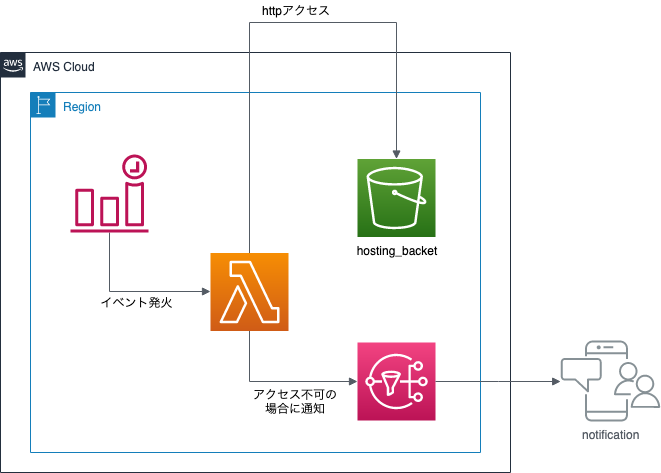

# HTMLサイトの簡易死活監視をしてみよう

## 概要

このハンズオンでは、AWS Lambdaを初めて使う方向けに、
Amazon S3で公開した静的HTMLサイトの簡易的な死活監視機能を、AWS Lambdaを使用して行います。

AWS LambdaはFaaS (Function as a Services) を提供してくれるサービスです。
AWS Lambdaを使用することで、サーバを意識することなく簡単なプログラムを実行することができます。

## 目的

このハンズオンでは、以下のことを行います。

- S3にバケットを作成する
- WebサイトのファイルをS3バケットに格納する
- S3バケットに静的ホスティング機能を有効化する
- LambdaでRubyのプログラムを作成する
- トリガーを設定する
- Rubyプログラムを作成する
- 動作を確認する
- Amazon SNSを使って通知する

## 全体図



## AWSマネジメントコンソールにアクセスする

1. [AWSのWebサイト](https://aws.amazon.com/jp/)にアクセスし、
    サイト右上にある「コンソールへログイン」をクリックします。
2. ログイン画面です。IAMユーザは「アカウント」には「アカウントID」を入れ、ユーザとパスワードにはIAMユーザのユーザ名とパスワードを入力します。
    ルートアカウントは、ユーザ名にルートアカウントのメールアドレスを入れ、パスワードにはルートアカウントのパスワードを入れます。
    必要事項を入力したら、「サインイン」をクリックします。
    - 多要素認証が有効な場合は、次の画面で認証トークンを入力します。
3. AWSマネジメントコンソールのトップページが開いたら完了です。

## 作業1: S3にバケットを作成する

まずは、静的HTMLサイトとしてホスティングするために、S3にバケットを作成しましょう。

1. AWSマネジメントコンソールで「サービス」から「S3」をクリックします。
2. 「バケットを作成する」をクリックします。
    「バケット作成」ダイアログボックスが表示されます。
3. 「名前とリージョン」ページで、以下のように設定します。
    - バケット名: jawsug-niigata-20190914-NUMBER-hosting
        - NUMBERを適当なランダムな番号に置き換えてください。
    - リージョン: 「アジアパシフィック (東京)」を選択してください
4. 「作成」をクリックします。
    初期設定の状態でバケットを作成する事ができます。
    - "The requested bucket name is not available"で始まるエラーが表示された場合は、すでに同じバケット名が世の中に存在していることを示しています。最初の「Edit」リンクをクリックしてバケット名を変更して再度作成してください。

    S3バケット一覧には、先ほど作成したバケット名が表示されています。
    「アクセス」項目欄には「バケットとオブジェクトは非公開」となっており、初期設定ではオブジェクトはインターネットに公開されません。

## 作業2: WebサイトのファイルをS3バケットに格納する

次に、ホスティング用のファイルをS3バケットに格納します。

1. 以下のリンクから、htmlファイルとfaviconをダウンロードします。
    - htmlファイル: [index.html](./src/aliveMonitoring/index.html)
    - faviconファイル: [favicon.ico](./src/aliveMonitoring/favicon.ico)
2. AWSマネジメントコンソールで「サービス」から「S3」をクリックします。
3. バケット名一覧からバケット「jawsug-niigata-20190914-NUMBER-hosting」をクリックします。
4. 「アップロード」をクリックします。
5. 「ファイルを追加」をクリックし、「index.html」を選択します。
6. 「さらにファイルを追加する」をクリックし、「favicon.ico」を選択します。
7. 「アップロード」をクリックします。
8. 一覧に2つのファイルが掲載されていればOKです。

## 作業3: S3バケットに静的ホスティング機能を有効化する

ここで、S3バケットに静的ホスティング機能を有効化します。
なお、S3バケットにパブリックアクセス権限を付けないと、HTMLファイルが表示できないので、
バケットポリシーにてパブリックアクセス権限を付与しています。

1. バケット内のページから「プロパティ」をクリックし、「Static Website hosting」をクリックします。
2. 「このバケットを使用してウェブサイトをホストする」を選択します。
3. 以下の項目を入力し、「保存」ボタンをクリックします。
    - インデックスドキュメント: index.html
4. エンドポイントのURLはメモしておきます。
    - `http://＜バケット名＞.s3-website-ap-northeast-1.amazonaws.com/`
5. バケット内のページから「アクセス権限」をクリックします。
6. 「ブロックパブリックアクセス」から、「編集」をクリックします。
7. 「パブリックアクセスをすべてブロック」のチェックを外し、「保存」をクリックします。
8. テキストボックスに「確認」と入力して「確認」ボタンをクリックします。
9. パブリックアクセス設定が全て「オフ」になっていればOKです。
10. 「バケットポリシー」をクリックします。
11. ARNの文字列をメモしておきます。
    - arn:aws:s3:::jawsug-niigata-20190914-NUMBER-hosting
12. ページ下部にある「ポリシージェネレーター」をクリックします。
    - 別タブでポリシージェネレータ画面が起動します
13. 以下の設定をします。
    - Select Type of Policy: S3 Bucket Policy
    - Effect: Allow
    - Principal: *
    - Actions: 「getObject」にチェック
    - Amazon Resource Name (ARN): 先ほどコピーしたARN文字列に、「/*」を末尾に付ける
        - arn:aws:s3:::jawsug-niigata-20190914-NUMBER-hosting/*
    - 「Add Statement」をクリック
14. 「Generate Policy」をクリックし、表示されたJSON文字列をコピーします。
15. S3の画面に戻り、バケットポリシーエディターにJSON文字列をペーストします。
16. 「保存」をクリックします。
    - 「このバケットにはパブリックアクセス権限があります」と表示されればOKです。
17. Webブラウザでエンドポイントにアクセスし、HTMLファイルが閲覧できることを確認します。
    - `http://＜バケット名＞.s3-website-ap-northeast-1.amazonaws.com/`

## 作業4: LambdaでRubyのプログラムを作成する

次に、LambdaでRubyプログラムを作成します。
まずはRubyの関数を1つ作成して、テスト実行できるところまでやってみましょう。

1. AWSマネジメントコンソールで「サービス」から「Lambda」をクリックします。
2. AWSマネジメントコンソールで右側に「東京」と表示されているか確認します。
    - 別のリージョン名が表示されていない場合は、リージョン名をクリックし「アジアパシフィック (東京)」を選択します。
    - S3のページではリージョンは「グローバル」となっており、リージョン変更できないため、
        今回はLambdaのページでリージョンの確認・変更をします。
3. 「関数の作成」をクリックします。
4. 「一から作成」が選択されていることを確認し、
    以下の項目を入力して、「関数の作成」をクリックします。
    - 関数名:
        - aliveMonitoring
    - ランタイム:
        - 今回は「Ruby 2.5」を選択します。
    - 実行ロールの選択または作成をクリック
    - ロール:
        - 「基本的なLambdaアクセス権限で新しいロールを作成」が選択されていることを確認
        - これにより、Lambdaの実行ログをCloudWatch Logsに書き込む権限がある
            「aliveMonitoring-role-XXXXXXXXX」というIAMロールが作成されます。
5. 関数「aliveMonitoring」が作成できたら、とりあえず現状のままで動かしてみましょう。
    「テスト」をクリックします。
6. テストイベントの作成画面では、以下の項目を設定して「作成」をクリックします。
    - イベント名: myFirstLambdaTest
7. 再度「テスト」をクリックします。
    - 実行結果が「成功」になるはずです。

## 作業5: トリガーを設定する

トリガーとは、Lambda関数が起動するきっかけとなるイベントです。
今回は、CloudWatch Eventsを使って、1分間隔で定期的に実行するようにします。

1. aliveMonitoringのページにある「設定」をクリックし、
    Designer内にある「トリガーを追加」をクリックします。
2. トリガーの設定では「CloudWatch Evnets」を選択し、以下の項目を入力して「追加」をクリックします。
    - ルール:
        - 新規ルールの作成
    - ルール名:
        - jawsug-niigata-20190914-aliveMonitoring
    - ルールパターン: スケジュール式
    - スケジュール式:
        - `rate(1 minute)`
    - 「トリガーの有効化」のチェックは入れたまま
3. 追加したら、「トリガー jawsug-niigata-20190914-aliveMonitoring が関数 aliveMonitoring に正常に追加されました。」と表示されていればOKです。

## 作業6: Rubyプログラムを作成する

関数コードのエディタ内に、以下のソースコードをコピーして貼り付けしましょう。
`ENDPOINT`の部分は適宜修正してください。

```ruby
require 'json'
require 'net/http'
require 'uri'

ENDPOINT = "http://＜S3バケット名＞.s3-website-ap-northeast-1.amazonaws.com/"
PATH = "favicon.ico"

def lambda_handler(event:, context:)
    uri = URI.parse(File.join(ENDPOINT, PATH))
    req = Net::HTTP::Get.new(uri.path)
    res = Net::HTTP.start(uri.host, uri.port) do |http|
        http.request(req)
    end
    if res.code == "200"
        { statusCode: 200, body: JSON.generate("200 OK.") }
    else
        { statusCode: res.code, body: JSON.generate("#{res.code} NG.") }
    end
end
```

書き直したら、忘れずに「保存」ボタンをクリックしましょう。

## 作業7: 動作を確認する

まずは、関数が動作するか確認しましょう。

1. 「テスト」をクリックします。
2. 実行結果が「成功」であり、詳細内の`statusCode`が`200`であることを確認します。
3. AWSマネジメントコンソールで「サービス」から「S3」をクリックします。
4. バケット名一覧からバケット「jawsug-niigata-20190914-NUMBER-hosting」をクリックします。
5. 「favicon.ico」にチェックを入れ、「アクション」「名前の変更」をクリックします。
    - 適宜ファイル名を変更します。
6. LambdaのaliveMonitoring関数の画面に戻り、再度「テスト」をクリックします。
7. 実行結果が「成功」であり、詳細内の`statusCode`が`404`であることを確認します。

次に、CloudWatch Logsにて、1分おきに関数が動作しているか確認しましょう。

1. 「モニタリング」をクリックし、「CloudWatch のログを表示」をクリックします。
    - なお、モニタリング画面でもすでに何回も実行されているはずなので、グラフが表示されているかと思います。
2. ログストリームの一番上に表示されているものをクリックします。
3. 約1分おきにログメッセージが表示されていればOKです。

## 作業8: Amazon SNSを使って通知をする

せっかくなので、監視の際にステータスコードが200以外の時に、
Amazon SNSを使って通知をしてもらうようにしましょう。
今回はSMSメッセージ通信にて通知メッセージをもらうようにします。

1. AWSマネジメントコンソールで「サービス」から「Simple Notification Service」をクリックします。
    - 「アプリケーション統合」のところにあります
2. 左側メニューから「トピック」をクリックし、「トピックの作成」をクリックします。
3. 以下の項目を入力して、「トピックの作成」をクリックします。
    - 名前:
        - jawsug-niigata-20190914-aliveMonitoringTopic
4. トピックの画面から「サブスクリプション」タブ内にある「サブスクリプションの作成」をクリックします。
5. 以下の項目を入力して、「サブスクリプションの作成」をクリックします。
    - プロトコル: SMS
    - エンドポイント: 携帯電話の番号
        - 例: 番号が「090-1234-5678」の場合
            - `+819012345678`
6. トピックのARN文字列をコピーしておきます。
    - arn:aws:sns:ap-northeast-1:XXXXXXXXXXXX:jawsug-niigata-20190914-aliveMonitoringTopic

次にLambdaからSNSへのアクセス権限を付与します。

1. AWSマネジメントコンソールで「サービス」から「IAM」をクリックします。
2. 左側メニューにある「ロール」をクリックし、先ほど作成されたIAMロール
    「aliveMonitoring-role-XXXXXXXX」をクリックします。
3. 「アクセス権限」タブ内にある「Permissions policies」の中にある
    「ポリシーをアタッチします」ボタンをクリックします。
4. 検索テキストボックスに「sns」と入力して、「AmazonSNSFullAccess」のチェックボックスを選択し、
    「ポリシーのアタッチ」をクリックします。
5. ポリシー一覧に「AmazonSNSFullAccess」が増えていることを確認します。
    - 今回はハンズオンなので全トピックに対してのフルアクセス権限を付与していますが、
        権限が必要なトピックを指定した方が本来は良いです。ここでは割愛します。
6. AWSマネジメントコンソールで「サービス」から「Lambda」をクリックします。
7. 関数一覧から「aliveMonitoring」をクリックします。
8. aliveMonitoringのページにある「設定」内にあるDesigner内の右側に
    「Amazon SNS」が増えていればOKです。

最後に、Lambda関数を修正して、テストします。

1. Lambdaの関数を以下のように変更します。
    ```ruby
    require 'aws-sdk'  # 追加
    require 'json'
    require 'net/http'
    require 'uri'

    ENDPOINT = "http://jawsug-niigata-20190914-NUMBER-hosting.s3-website-ap-northeast-1.amazonaws.com/"
    PATH = "favicon.ico"
    # 追加（適宜ARN文字列を修正すること）
    SNS_TOPIC_ARN = "arn:aws:sns:ap-northeast-1:XXXXXXXXXXXX:jawsug-niigata-20190914-aliveMonitoringTopic"

    def lambda_handler(event:, context:)
        uri = URI.parse(File.join(ENDPOINT, PATH))
        req = Net::HTTP::Get.new(uri.path)
        res = Net::HTTP.start(uri.host, uri.port) do |http|
            http.request(req)
        end
        if res.code == "200"
            { statusCode: 200, body: JSON.generate("200 OK.") }
        else
            # 追加ここから
            sns = Aws::SNS::Resource.new(region: 'ap-northeast-1')
            topic = sns.topic(SNS_TOPIC_ARN)
            topic.publish({
                message: "endpoint #{res.code} NG."
            })
            # 追加ここまで
            { statusCode: res.code, body: JSON.generate("#{res.code} NG.") }
        end
    end
    ```
2. 「保存」をクリックし、「テスト」をクリックします。
3. SMSメッセージが受信できていればOKです。

## 作業9: トリガーを無効にする

現在1分おきにLambda関数が起動している状態なので、
トリガーを無効にしておきます。

1. aliveMonitoringのページにある「設定」をクリックし、
    Designer内の左側にある「CloudWatch Events」をクリックします。
2. 「有効」のトルグスイッチをクリックして「無効」にします。
3. 「保存」をクリックします。

以上です。
お疲れ様でした。

---
