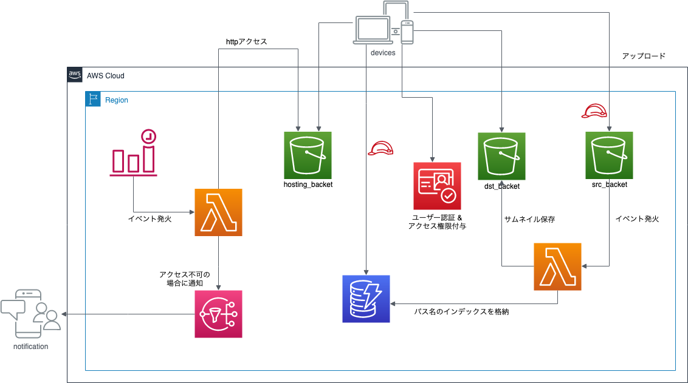
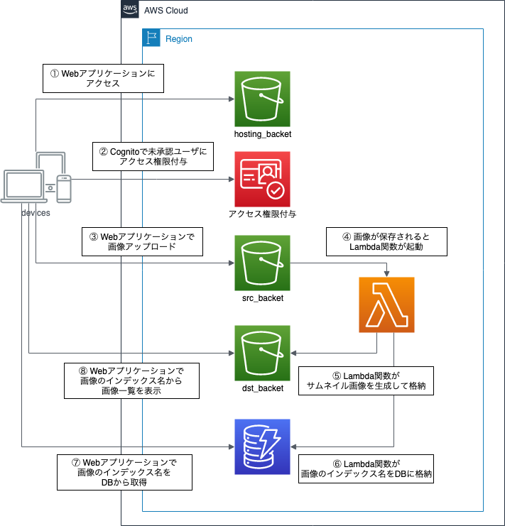

# S3に保存した画像の一覧を表示するアプリを作成しよう

## 概要

このハンズオンでは、AWS Lambdaを初めて使う方向けに、
Amazon S3に保存した画像の一覧を表示するアプリケーションを、AWS Lambdaを使用して構築します。

AWS LambdaはFaaS (Function as a Services) を提供してくれるサービスです。
AWS Lambdaを使用することで、サーバを意識することなく簡単なプログラムを実行することができます。

なお、このハンズオンでは、「S3に保存した画像のサムネイルを作成しよう」と
「HTMLサイトの簡易死活監視をしてみよう」のハンズオン内容を元にして構築を進めます。

## 目的

このハンズオンでは、以下のことを行います。

- CognitoのIDプールを作成する
- CognitoのIAMロールにポリシーを適用する (S3バケットへの書き込み)
- 公開用HTMLを修正してS3バケットに格納する
- 画像アップロード先のS3バケットにCORS設定をする
- 画像アップロード先のS3バケットを公開設定可能にする
- 画像アップロードの動作確認をする
- DynamoDBのテーブルを作成する
- LambdaのIAMポリシーにポリシーを適用する
- LambdaのPythonプログラムを変更する
- CognitoのIAMロールにポリシーを適用する (DynamoDBへのクエリ)
- 公開用HTMLを修正してS3バケットに格納する
- サムネイル画像S3バケットを公開設定可能にする
- 動作を確認する
- 最後に後片付け

## 全体図



## 今回のアプリで行う処理の流れ

- 公開用HTMLがあるS3バケット: jawsug-niigata-20190914-NUMBER-hosting
    - 前のハンズオンで、すでに静的Webサイトホスティングが有効化されています
- 画像アップロード先S3バケット: jawsug-niigata-20190914-NUMBER-src
    - 前のハンズオンで、すでに構築済
    - 画像が保存されると、サムネイル画像保存先S3バケットにサムネイル画像が保存される機能が、
        すでに構築済
- サムネイル画像保存先S3バケット: jawsug-niigata-20190914-NUMBER-dst
    - 前のハンズオンで、すでに構築済



1. 公開用HTMLに保存されている、今回のWebアプリケーションのサイトにアクセス
2. Cognitoにアクセスして未承認アクセスユーザに対してS3およびDynamoDBへのアクセス権限を付与
3. Webアプリケーションで画像をアップロードし、画像アップロード先S3バケットに画像を保存
4. 画像アップロード先S3バケットに画像が保存されるとLambda関数が起動
5. Lambda関数で、サムネイル画像を作成してサムネイル画像保存先S3バケットに格納
6. 上記Lambda関数で、DynamoDBに画像へアクセスするためのインデックスを格納
7. WebアプリケーションでDynamoDBにアクセスし、画像一覧のインデックス名を取得
8. 画像インデックス名から画像一覧を表示

## AWSマネジメントコンソールにアクセスする

1. [AWSのWebサイト](https://aws.amazon.com/jp/)にアクセスし、
    サイト右上にある「コンソールへログイン」をクリックします。
2. ログイン画面です。IAMユーザは「アカウント」には「アカウントID」を入れ、ユーザとパスワードにはIAMユーザのユーザ名とパスワードを入力します。
    ルートアカウントは、ユーザ名にルートアカウントのメールアドレスを入れ、パスワードにはルートアカウントのパスワードを入れます。
    必要事項を入力したら、「サインイン」をクリックします。
    - 多要素認証が有効な場合は、次の画面で認証トークンを入力します。
3. AWSマネジメントコンソールのトップページが開いたら完了です。

## 作業1. CognitoのIDプールを作成する

1. AWSマネジメントコンソールで「サービス」から「Cognito」をクリックします。
2. 「IDプールの管理」をクリック
3. 新しいIDプールの作成で以下の項目を入力し「プールの作成」をクリックします。
    - IDプール名
        - jawsug_niigata_20190914_idpool
    - 「認証されていないIDに対してアクセスを有効にする」にチェック
4. 「Identify the IAM roles to use with your new identity pool」で、
    以下のようにIAMロール設定（デフォルトでOK）をして、「許可」をクリックします。
    - 「Your authenticated identities would like access to Cognito.」
        - IAMロール: 「新しいIAMロールの作成」（デフォルト）
        - ロール名: 「Cognito_jawsug_niigata_20190914_idpoolAuth_Role」（デフォルト）
    - 「Your unauthenticated identities would like access to Cognito.」
        - IAMロール: 「新しいIAMロールの作成」（デフォルト）
5. 「Amazon Cognitoでの作業開始」では、以下の内容をメモして「ダッシュボードに移動」をクリックします。
    - プラットフォーム: JavaScript
    - AWS認証情報の取得の中の「IdentityPoolId」をメモ
        ```javascript
        // Amazon Cognito 認証情報プロバイダーを初期化します
        AWS.config.region = 'ap-northeast-1'; // リージョン
        AWS.config.credentials = new AWS.CognitoIdentityCredentials({
            IdentityPoolId: 'ap-northeast-1:XXXXXXXX-XXXX-XXXX-XXXX-XXXXXXXXXXXX',
        });
        ```
    - もしIdentityPoolIdをメモし忘れた場合は、
        IDプールのダッシュボードから「IDプールの編集」をクリックし、
        「IDプールのID」に記述されているのでメモしておく。

## 作業2. CognitoのIAMロールにポリシーを適用する (S3バケットへの書き込み)

1. AWSマネジメントコンソールで「サービス」から「IAM」をクリックします。
2. 左側メニューにある「ロール」をクリックし、
    「Cognito_jawsug_niigata_20190914_idpoolUnauth_Role」をクリックします。
    - 「Cognito_jawsug_niigata_20190914_idpoolAuth_Role」と「Cognito_jawsug_niigata_20190914_idpoolUnauth_Role」ができているので、「Cognito_jawsug_niigata_20190914_idpoolUnauth_Role」をクリック
3. 「アクセス権限」タブ内の「Permissions policies」内にある「インラインポリシーの追加」をクリックします。
4. 「JSON」タブにして、以下のJSONをコピペ（コメント文字列部分は削除してください）して「ポリシーの確認」をクリックします。
    ```json
    {
        "Version": "2012-10-17",
        "Statement": [
            {
                "Effect": "Allow",
                "Action": [
                    "s3:PutObject",
                    "s3:PutObjectAcl"
                ],
                "Resource": [
                    "arn:aws:s3:::jawsug-niigata-20190914-NUMBER-src/*" // ここを各自修正してください。
                ]
            }
        ]
    }
    ```
5. ポリシーの確認画面では以下の設定をして「ポリシーの作成」をクリックします。
    - 名前: jawsug-niigata-20190914-imageupload_s3_policy
6. ロールのポリシー一覧に追加されていればOKです。

## 作業3. 公開用HTMLを修正してS3バケットに格納する

1. 以下のリンクからファイルをダウンロードする。
    - [imagelist_html.zip](./src/imagelist_html.zip)
2. HTML書き換えのための設定を調べる
    - Cognito Identity Pool ID: 先ほどメモしておいたもの
        - メモし忘れたら「Cognito」→「ダッシュボード」→「IDプールの編集」に記載
            - ap-northeast-1:XXXXXXXX-XXXX-XXXX-XXXX-XXXXXXXXXXXX
    - 画像アップロード先S3バケット名: jawsug-niigata-20190914-NUMBER-src
3. "index1.html"をエディタで開き、HTMLの中の設定を書き換える。
    - UTF-8が扱えるエディタを使用してください。
        - Atom, VSCode, TeraPad, サクラエディタ, 他
        - Windowsのメモ帳は不可
    ```html
    <!DOCTYPE html>
    <html lang="ja">
    <head>
        <meta charset="UTF-8"><title>ImageUploader</title>
        <script src="https://sdk.amazonaws.com/js/aws-sdk-2.524.0.min.js"></script>
    </head>
    <body>
    <script>
    var srcBucket = "jawsug-niigata-20190914-NUMBER-src"     // ここを画像アップロード先S3バケット名に修正してください。

    // Cognito
    var params = {
        IdentityPoolId: "ap-northeast-1:XXXXXXXX-XXXX-XXXX-XXXX-XXXXXXXXXXXX" // ここをCognito IDプールIDに修正してください。
    };
    AWS.config.region = "ap-northeast-1";
    AWS.config.credentials = new AWS.CognitoIdentityCredentials(params);
    AWS.config.credentials.get( function (err) {
        if (err) {
            console.log(err);
        } else {
            console.log("Successfully authorized. ID:" + AWS.config.credentials.identityId);
        }
    });
    // S3 Upload
    function upload () {
        console.log("Now uploading...");
        var s3 = new AWS.S3({params:{Bucket: srcBucket}});
        var file = document.getElementById("fileToUpload").files[0];
        if (file) {
            s3.putObject({
                Key:file.name, ContentType:file.type, Body:file, ACL:"public-read"
            }, function (err, data) {
                if (err) {
                    console.log(err);
                } else {
                    console.log("Successfully uploaded.");
                }
            });
        }
    }
    </script>
        <input type="file" name="fileToUpload" id="fileToUpload">
        <input type="submit" value="upload" onclick="upload()">
    </body>
    </html>
    ```
4. AWSマネジメントコンソールで「サービス」から「S3」をクリックします。
5. バケット名一覧からバケット「jawsug-niigata-20190914-NUMBER-hosting」をクリックします。
6. 「アップロード」をクリックします。
7. 「ファイルを追加」をクリックし、「index1.html」を選択します。
8. 「アップロード」をクリックします。
9. アップロードに成功していればOKです。

## 作業4. 画像アップロード先のS3バケットにCORS設定をする

1. S3のバケット一覧画面から、S3の画像アップロード先バケット「jawsug-niigata-20190914-NUMBER-src」を選択
2. バケット内のページから「アクセス権限」をクリックし、「CORSの設定」をクリックします。
3. CORS構成エディタにて、以下のXMLファイルをコピペして「保存」
    ```xml
    <CORSConfiguration>
        <CORSRule>
            <AllowedOrigin>*</AllowedOrigin>
            <AllowedMethod>GET</AllowedMethod>
            <AllowedMethod>PUT</AllowedMethod>
            <AllowedMethod>POST</AllowedMethod>
            <AllowedMethod>DELETE</AllowedMethod>
            <AllowedHeader>*</AllowedHeader>
        </CORSRule>
    </CORSConfiguration>
    ```

この設定を行わないと、公開HTML内でのJavaScriptにてファイルアップロードする際に、
CORSポリシーによってブロックされてしまい、「403」エラーになってしまいます。

## 作業5. 画像アップロード先のS3バケットを公開設定可能にする

1. S3の画像アップロード先バケット「jawsug-niigata-20190914-NUMBER-src」内のページから、
    「アクセス権限」をクリックし、「ブロックパブリックアクセス」をクリックします。
2. 「ブロックパブリックアクセス」から、「編集」をクリックします。
3. 「パブリックアクセスをすべてブロック」のチェックを外し、「保存」をクリックします。
4. テキストボックスに「確認」と入力して「確認」ボタンをクリックします。
5. パブリックアクセス設定が全て「オフ」になっていればOKです。

Webアプリケーションにて画像アップロードをする際に、画像ファイルに公開読み取りアクセス権限を付与します。
この設定をオフにしないと、画像ファイルに権限を付与できないので「403」エラーになってしまいます。

## 作業6. 画像アップロードの動作確認をする

ここで、画像アップロード機能ができるか確認しましょう。

1. Webアプリケーションにアクセス
    - [http://jawsug-niigata-20190914-NUMBER-hosting.s3-website-ap-northeast-1.amazonaws.com/index1.html](http://jawsug-niigata-20190914-NUMBER-hosting.s3-website-ap-northeast-1.amazonaws.com/index1.html)
2. 画像をアップロードして、srcバケットに画像がアップロードされていればOKです。
3. dstバケットにサムネイル画像もあるはずです。

## 作業6. DynamoDBのテーブルを作成する

1. AWSマネジメントコンソールで「サービス」から「DynamoDB」をクリックします。
2. 「テーブル作成」をクリックします。
3. 「DynamoDB テーブルの作成」では以下の項目を設定して、「作成」をクリックします。
    - テーブル名
        - jawsug-niigata-20190914-imagelist
    - プライマリーキー
        - id
        - 「文字列」のまま
    - 「ソートキーの追加」にチェック
        - timestamp
        - 「文字列」のまま
    - 「デフォルト設定の使用」はそのままチェックを入れる
4. テーブルが作成できていることを確認
5. 作成したテーブルの「概要」タブ内にある「Amazon リソースネーム (ARN)」の文字列をメモしておく
    - arn:aws:dynamodb:ap-northeast-1:XXXXXXXXXXXX:table/jawsug-niigata-20190914-imagelist

## 作業7. LambdaのIAMポリシーにポリシーを適用する

1. AWSマネジメントコンソールで「サービス」から「IAM」をクリックします。
2. 左側メニューにある「ロール」をクリックし、IAMロール
    「createThumbnail-role-XXXXXXXX」をクリックします。
3. 「アクセス権限」タブ内の「Permissions policies」内にある「インラインポリシーの追加」をクリックします。
4. 「JSON」タブにして、以下のJSONをコピペして「ポリシーの確認」をクリックします。
    - Resource内の文字列は、DynamoDBテーブルのARN文字列
    ```json
    {
        "Version": "2012-10-17",
        "Statement": [
            {
                "Effect": "Allow",
                "Action": [
                    "dynamodb:PutItem"
                ],
                "Resource": [
                    "arn:aws:dynamodb:ap-northeast-1:XXXXXXXXXXXX:table/jawsug-niigata-20190914-imagelist"
                ]
            }
        ]
    }
    ```
5. ポリシーの確認画面では以下の設定をして「ポリシーの作成」をクリックします。
    - 名前: jawsug-niigata-20190914-imageupload_dynamodb_policy
6. ロールのポリシー一覧に追加されていればOKです。

## 作業8. LambdaのPythonプログラムを変更する

今回もプログラムは書かずに、すでに用意されているファイルを使います。

1. 以下のリンクからファイルをダウンロードする。
    - [imagelist.zip](./src/imagelist.zip)
2. AWSマネジメントコンソールで「サービス」から「Lambda」をクリックします。
3. 関数一覧から「createThumbnail」をクリックします。
4. 「アップロード」をクリックし、先ほどダウンロードしたzipファイル(imagelist.zip)を選択
5. 「保存」をクリック

### 補足: Pythonプログラム

今回使用するプログラムは以下の通りです。
Python 3.7のランタイムで動作するLambda関数です。
先ほど実施した、サムネイル生成ハンズオンの一部を修正しています。

```python
from PIL import Image
import boto3
import urllib.parse
import os
import json
from datetime import datetime  # add

DST_BUCKET = os.environ['DST_BUCKET']
MAX_WIDTH  = os.environ.get('MAX_WIDTH', 100)
MAX_HEIGHT = os.environ.get('MAX_HEIGHT', 100)
DYNAMODB_TABLE = os.environ.get('DYNAMODB_TABLE', 'jawsug-niigata-20190914-imagelist')  # add

def lambda_handler(event, context):
    src_bucket = event['Records'][0]['s3']['bucket']['name']
    src_key = urllib.parse.unquote_plus(event['Records'][0]['s3']['object']['key'], encoding='utf-8')

    dst_bucket = DST_BUCKET
    splitext = os.path.splitext(src_key)
    dst_key = '{}_thumb{}'.format(splitext[0], splitext[1])

    tmp = '/tmp/' + os.path.basename(src_key)

    s3 = boto3.client('s3')
    dynamodb = boto3.client('dynamodb')  # add
    try:
        s3.download_file(Bucket=src_bucket, Key=src_key, Filename=tmp)
        img = Image.open(tmp)
        img.thumbnail((MAX_WIDTH, MAX_HEIGHT), Image.LANCZOS)
        img.save(tmp)
        s3.upload_file(Filename=tmp, Bucket=dst_bucket, Key=dst_key, ExtraArgs={'ACL': 'public-read'})  # add public-read ACL
        ## add start
        nowtime = datetime.now().strftime('%Y-%m-%d %H:%M:%S')
        dynamodb.put_item(
            TableName = DYNAMODB_TABLE,
            Item = {
                'id': {'S': 'ImageList'},
                'timestamp': {'S': nowtime},
                'original': {'S': src_key},
                'thumbnail': {'S': dst_key},
            }
        )
        ## add end
        ret = {
            'statusCode': 200,
            'body': json.dumps({'message': 'create thumbnail: {0}/{1}'.format(dst_bucket, dst_key)})
        }
        return ret
    except Exception as e:
        print(e)
        raise e
```

## 作業9. CognitoのIAMロールにポリシーを適用する (DynamoDBへのクエリ)

WebアプリケーションからDynamoDBにアクセスして一覧取得できるようにするため、
CognitoのIAMロールに権限を付与します。

1. AWSマネジメントコンソールで「サービス」から「IAM」をクリックします。
2. 左側メニューにある「ロール」をクリックし、
    「Cognito_jawsug_niigata_20190914_idpoolUnauth_Role」をクリックします。
3. 「アクセス権限」タブ内の「Permissions policies」内にある「インラインポリシーの追加」をクリックします。
4. 「JSON」タブにして、以下のJSONをコピペして「ポリシーの確認」をクリックします。
    - Resource内の文字列は、DynamoDBテーブルのARN文字列
    ```json
    {
        "Version": "2012-10-17",
        "Statement": [
            {
                "Effect": "Allow",
                "Action": [
                    "dynamodb:Query"
                ],
                "Resource": [
                    "arn:aws:dynamodb:ap-northeast-1:XXXXXXXXXXXX:table/jawsug-niigata-20190914-imagelist"
                ]
            }
        ]
    }
    ```
5. ポリシーの確認画面では以下の設定をして「ポリシーの作成」をクリック
    - 名前: jawsug-niigata-20190914-imagelist_dynamodb_policy
6. ロールのポリシー一覧に追加されていればOK

## 作業10. 公開用HTMLを修正してS3バケットに格納する

1. 先ほどダウンロードした"imagelist_html.zip"の中から、
    "index2.html"をエディタで開き、HTMLの中の設定を書き換える。
    - UTF-8が扱えるエディタを使用してください。
        - Atom, VSCode, TeraPad, サクラエディタ, 他
        - Windowsのメモ帳は不可

```html
<!DOCTYPE html>
<html lang="ja">
<head>
    <meta charset="UTF-8"><title>ImageUploader</title>
    <script src="https://sdk.amazonaws.com/js/aws-sdk-2.524.0.min.js"></script>
</head>
<body>
<script>
var srcBucket = "jawsug-niigata-20190914-NUMBER-src"     // ここを修正してください。
var dstBucket = "jawsug-niigata-20190914-NUMBER-dst"     // ここを修正してください。
var dynamodbTable = "jawsug-niigata-20190914-imagelist"

// Cognito
var params = {
    AccountId: "XXXXXXXXXXXX", // ここを修正してください。
    RoleArn: "arn:aws:iam::XXXXXXXXXXXX:role/Cognito_jawsug_niigata_20190914_idpoolUnauth_Role", // ここを修正してください。
    IdentityPoolId: "ap-northeast-1:XXXXXXXX-XXXX-XXXX-XXXX-XXXXXXXXXXXX" // ここを修正してください。
};
AWS.config.region = "ap-northeast-1";
AWS.config.credentials = new AWS.CognitoIdentityCredentials(params);
AWS.config.credentials.get( function (err) {
    if (err) {
        console.log(err);
    } else {
        console.log("Successfully authorized. ID:" + AWS.config.credentials.identityId);
    }
});
// S3 Upload
function upload () {
    console.log("Now uploading...");
    var s3 = new AWS.S3({params:{Bucket: srcBucket}});
    var file = document.getElementById("fileToUpload").files[0];
    if (file) {
        s3.putObject({
            Key:file.name, ContentType:file.type, Body:file, ACL:"public-read"
        }, function (err, data) {
            if (err) {
                console.log(err);
            } else {
                console.log("Successfully uploaded.");
            }
        });
    }
}
//DynamoDB Query
function download () {
    console.log("Now loading...");
    var dynamodb = new AWS.DynamoDB({params: {TableName: dynamodbTable}});
    dynamodb.query({
        ExpressionAttributeValues: {
            ":id": { S: "ImageList" }
        },
        KeyConditionExpression: "id = :id",
        ProjectionExpression: "original, thumbnail"
    }, function(err, data) {
        if (err) {
            console.log(err);
        } else {
            var wrapper = document.getElementById('imagelist');
            wrapper.innerHTML = '';
            data.Items.map(function(item) {
                var a = document.createElement('a');
                a.href = "http://" + srcBucket + ".s3-ap-northeast-1.amazonaws.com/" + item.original.S;
                var img = document.createElement('img');
                img.src = "http://" + dstBucket + ".s3-ap-northeast-1.amazonaws.com/" + item.thumbnail.S;
                a.appendChild(img);
                return a;
            }).forEach(function(a) {
                wrapper.appendChild(a);
                wrapper.appendChild(document.createElement('br'));
            });
            console.log("Successfully loaded.");
        }
    });
}
</script>
    <input type="file" name="fileToUpload" id="fileToUpload">
    <input type="submit" value="upload" onclick="upload()">
    <input type="submit" value="download" onclick="download()">
    <hr>
    <div id="imagelist"></div>
</body>
</html>
```

## 作業11. サムネイル画像S3バケットを公開設定可能にする

1. S3のバケット一覧画面から、サムネイル画像格納先S3バケット「jawsug-niigata-20190914-NUMBER-dst」を選択します。
2. バケット内のページから「アクセス権限」をクリックし、「ブロックパブリックアクセス」をクリックします。
3. 「ブロックパブリックアクセス」から、「編集」をクリックします。
4. 「パブリックアクセスをすべてブロック」のチェックを外し、「保存」をクリックします。
5. テキストボックスに「確認」と入力して「確認」ボタンをクリックします。
6. パブリックアクセス設定が全て「オフ」になっていればOKです。

## 作業12. 動作を確認する

ここまでできれば、Webアプリケーションにアクセスして
画像アップロード機能と画像一覧表示ができるか確認しましょう。

1. Webアプリケーションにアクセス
    - [http://jawsug-niigata-20190914-NUMBER-hosting.s3-website-ap-northeast-1.amazonaws.com/index2.html](http://jawsug-niigata-20190914-NUMBER-hosting.s3-website-ap-northeast-1.amazonaws.com/index2.html)
2. 画像をアップロードして、srcバケットに画像がアップロードされていればOKです。
3. dstバケットにサムネイル画像もあるはずです。
4. ダウンロードボタンをクリックすると、先ほどアップロードした画像のサムネイル画像が画面に表示されます。
    - DynamoDBにインデックス名が保存された画像のみが対象です。
5. 画像をクリックすると、元の画像が表示されます。

## 最後に後片付け

### 1. DynamoDBテーブルの削除

1. AWSマネジメントコンソールで「サービス」から「DynamoDB」をクリックします。
2. 左側メニューの「テーブル」をクリックします。
3. テーブルを選択して「テーブルの削除」をクリックします。

### 2. Cognito IDプールの削除

1. AWSマネジメントコンソールで「サービス」から「Cognito」をクリックします。
2. 「IDプールの管理」をクリックします。
3. 作成したIDプール「jawsug-niigata-20190914-idpool」をクリックします。
4. 「IDプールの編集」をクリックします。
5. 「IDプールの削除」をクリックしてボタンを表示し、「IDプールの削除」をクリックします。

### 3. Lambda関数の削除

1. AWSマネジメントコンソールで「サービス」から「Lambda」をクリックします。
2. 左側メニューの「関数」をクリックします。
3. 作成した関数の左側のラジオボタンをクリックして、「アクション」⇒「削除」をクリックします。
    - createThumbnail
    - aliveMonitoring

### 4. S3バケットの削除

3つあるので、以下のバケットを削除しましょう。

- jawsug-niigata-20190914-NUMBER-hosting
- jawsug-niigata-20190914-NUMBER-src
- jawsug-niigata-20190914-NUMBER-dst

### 5. SNSトピックとサブスクリプションの削除

1. AWSマネジメントコンソールで「サービス」から「Simple Notification Service」をクリックします。
2. 左側のメニューから「トピック」をクリックします。
3. トピックを選択して、「削除」をクリックします。
    - jawsug-niigata-20190914-aliveMonitoringTopic
    - dynamodb (オプション)
4. 削除の際は「これを削除」と入力して「削除」をクリックします。
5. 左側のメニューから「サブスクリプション」をクリックします。
6. 該当するエンドポイント（今回は電話番号）を選択して、「削除」をクリックします。

### 6. CloudWatch Eventの削除

1. AWSマネジメントコンソールで「サービス」から「CloudWatch」をクリックします。
2. 左側のメニューから「イベント」の「ルール」をクリックします。
3. ルール「jawsug-niigata-20190914-aliveMonitoring」を選択して、「アクション」⇒「削除」をクリックします。

### 7. CloudWatch Logsのロググループ削除

1. AWSマネジメントコンソールで「サービス」から「CloudWatch」をクリックします。
2. 左側のメニューから「ログ」をクリックします。
3. ロググループを選択して、「アクション」⇒「ロググループの削除」をクリックします。
    - /aws/lambda/createThumbnail
    - /aws/lambda/aliveMonitoring

### 8. IAMロールの削除

1. AWSマネジメントコンソールで「サービス」から「IAM」をクリックします。
2. 左側のメニューから「ロール」をクリックします。
3. 該当するロールを選択して「ロールの削除」をクリックします。
    - Cognito_jawsug_niigata_20190914_idpoolAuth_Role
    - Cognito_jawsug_niigata_20190914_idpoolUnauth_Role
    - createThumbnail-role-XXXXXXXXX
    - aliveMonitoring-role-XXXXXXXXX

以上です。おつかれさまでした。
